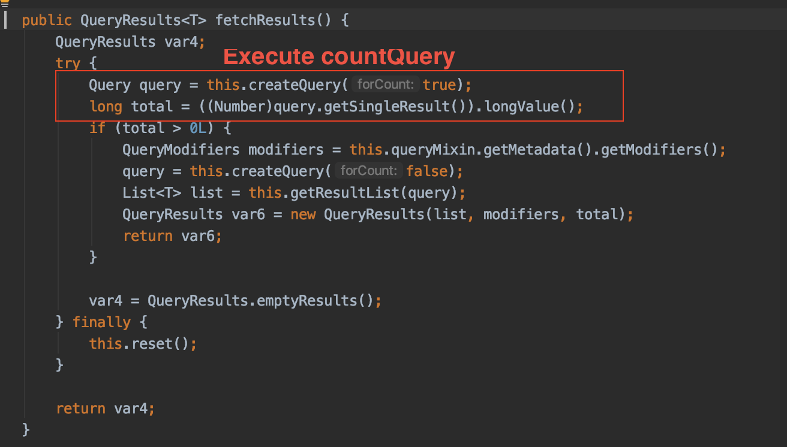

# Querydsl 4.3.1 `fetchResults` in AbstractJPASQLQuery bug test

## Problem

If `fetchResults` is called using` JpaSQLQuery`, illegalArgumentException occurs.

## Description

When calling `fetchResults`, the` count` query is called beforehand.

If `ResultTransform` is set to receive the result value of the query as a desired object, illegalException occurs.

Why is this error occurring?

The reason is that you want to convert the result value of the count query that is executed in advance to `ResultTransform`.

To reproduce this error condition, I created the `projections.bean` test for FactoryExpression as below.

```
public QueryResults<BookName> getBooksWithProjectionFromJPASQL(int offset, int limit) {
        SQLTemplates oracleTemplate = OracleTemplates.builder().printSchema().build();
        JPAHelper jpaHelper = new JPAHelper(emf.createEntityManager(), oracleTemplate);

        Map<String, Expression<?>> bindings = new HashMap<>();
        bindings.put("name", book.name);

        return jpaHelper.query()
                        .select(Projections.bean(BookName.class, bindings))
                        .from(book)
                        .offset(offset)
                        .limit(limit)
                        .fetchResults();
    }
```

When fetchResults is called, the following code is executed.



```
 private Query createQuery(boolean forCount) {
         NativeSQLSerializer serializer = (NativeSQLSerializer) serialize(forCount);
         String queryString = serializer.toString();
         logQuery(queryString, serializer.getConstantToAllLabels());
         Expression<?> projection = queryMixin.getMetadata().getProjection();
         Query query;

         .
         .
         .
         . [!] code line 161 - 165       
         if (projection instanceof FactoryExpression) {
             if (!queryHandler.transform(query, (FactoryExpression<?>) projection)) {
                 this.projection = (FactoryExpression<?>) projection;
             }
         }
 
         return query;
     }
```

Let's look at the logic of code line 161 of the createQuery function.

What code lines 161-165 mean is applying a `ResultTransform` for projection

__But the problem here is that the forCount query must `skip` this logic.__

If skip is not performed, ResultTransform is applied to forCount query, and `illegalArgumentException` occurs.

## My Suggest

To solve this problem, I simply added `!ForCount` to conditional statement.

## Integration Test

After changing the code as below, I created a querydsl-jpa snapshot jar and added it to the external lib.

```
[Fixed]

.
.
. code line 161
 if (!forCount && projection instanceof FactoryExpression) { <---- added !forCount
    if (!queryHandler.transform(query, (FactoryExpression<?>) projection)) {
        this.projection = (FactoryExpression<?>) projection;
    }
 }
```

And I could confirm that the below test works normally.

```
    @Test
    public void should_Get_Books_With_Projection_From_JPASQL() {
        final int offset = 0;
        final int limit = 10;

        executeQueryForInsert(emf.createEntityManager(), firstBook);

        QueryResults<BookName> bookNames = bookRepository.getBooksWithProjectionFromJPASQL(offset, limit);

        assertThat(bookNames.getResults().get(0).getName()).isEqualTo(bookName);
    }
```


